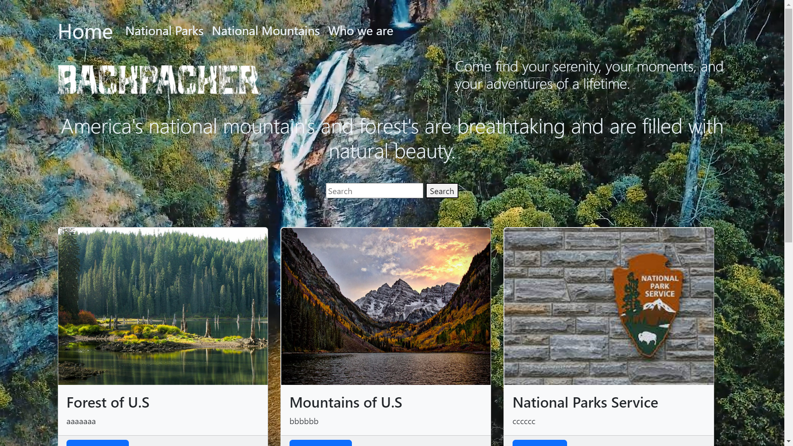
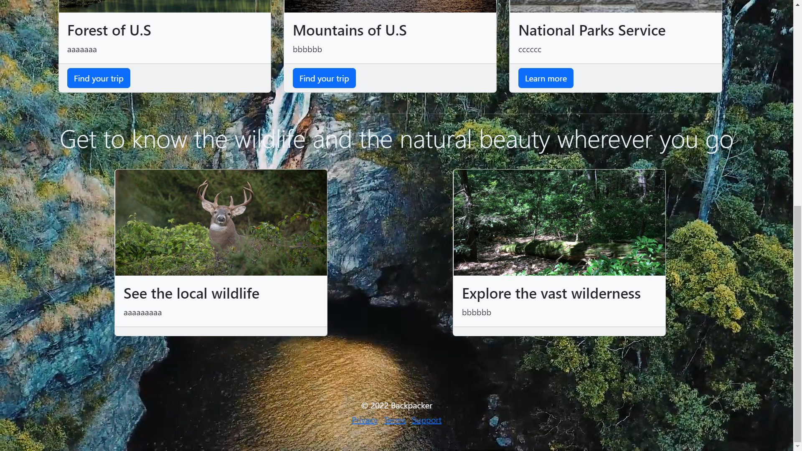
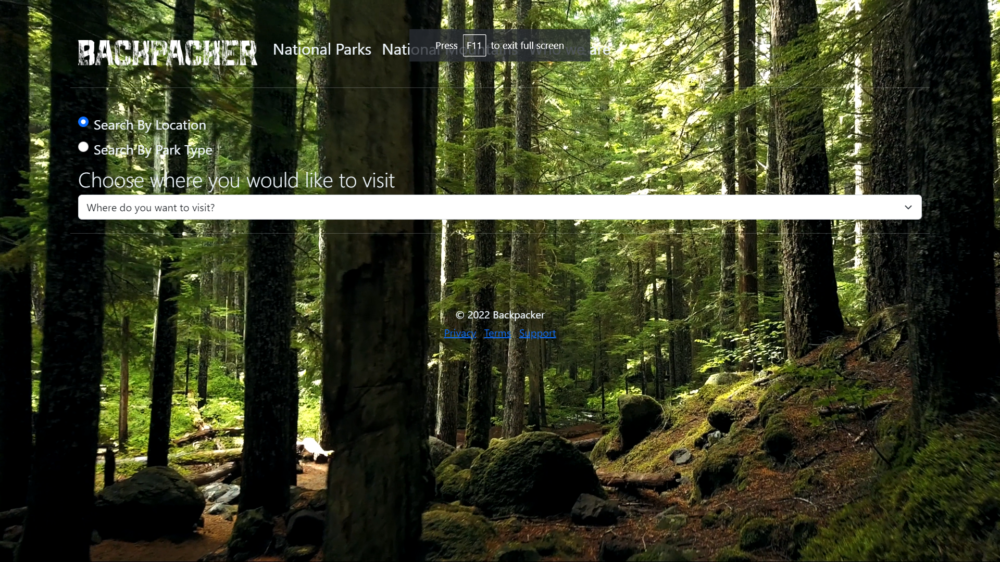
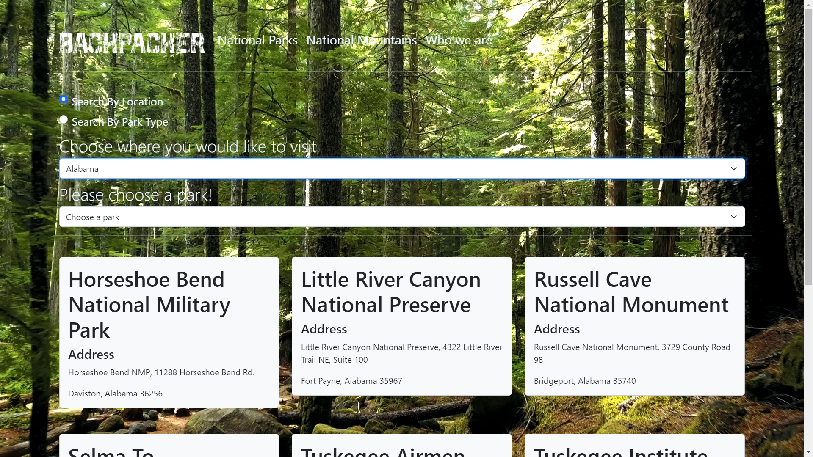
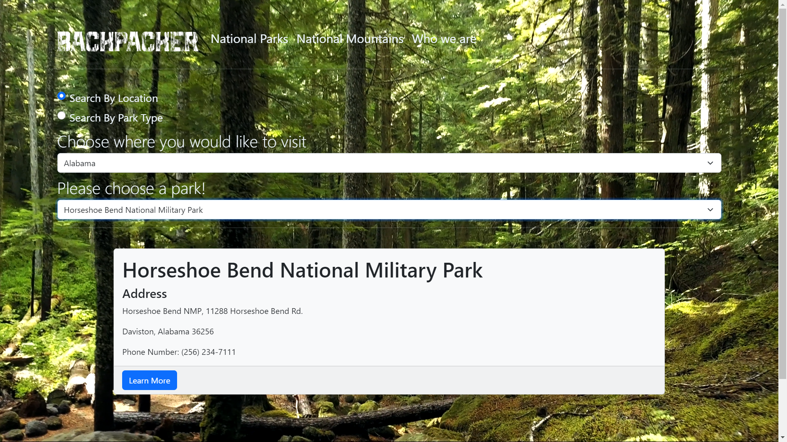
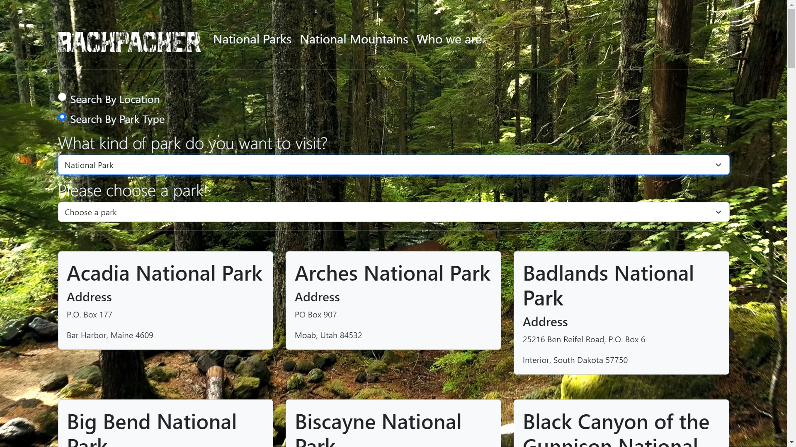
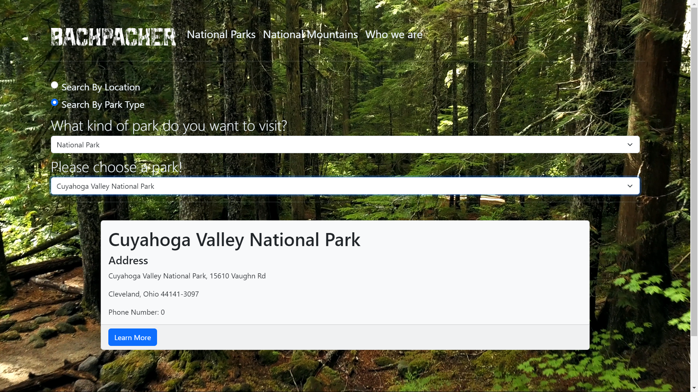
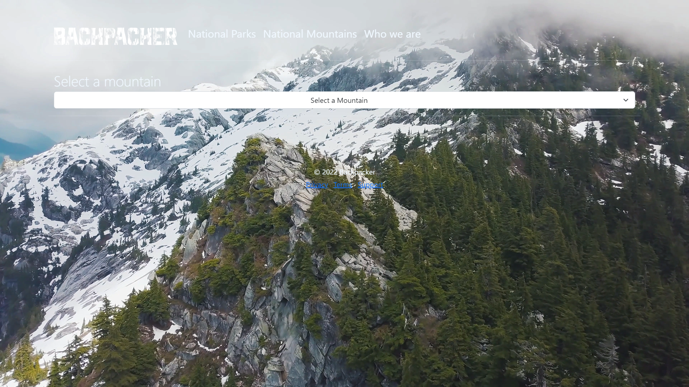
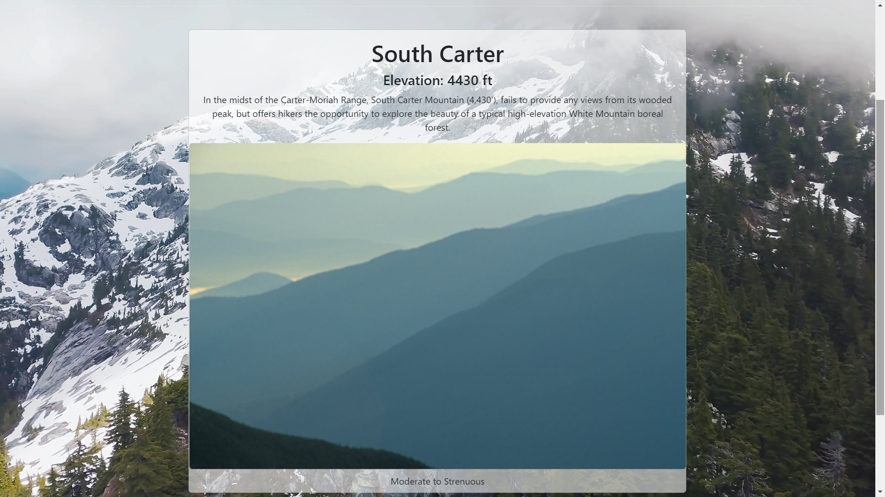

# Enjoy_the_Outdoor
Current date: 11/21/2022

This the second major project we had to do
For this project I had to build a website to help a user find things to do for the great outdoors. 

I had to create 3 pages

A Home page:
This is meant to be a simple page that just provide some info and a link to the parks and mountain page

A Parks Page:
This page is meant to provide the user a way to search through the parks and display information about them. The information for the parks were already given to us, but we need to create menus and pull the information from the data given.

A Mountain page:
The last page is a mountain search page. Much like the parks page, this page is meant to provide the user a way to search through mountains and display information about them. The information for the mountains were also already given to us, but we need to create menus and pull the information from the data given.

This project was meant to test our javascript knowledge as we had to create the dropdown menu and the card the info would be in our javascript code rather then HTML code.

An interesting bit of code that I wrote for this project is:

The reason I like this code is that for the project we were given 3 sets of data. A parks type, a parks location and the actual national parks data. I had to basically match the parks type data with any matches in the national parks data but the national park data has the full name of the park. So I had to think of a way to have it look through each of the national park data name and see if any matches park type data name and if it does would it display cards.
